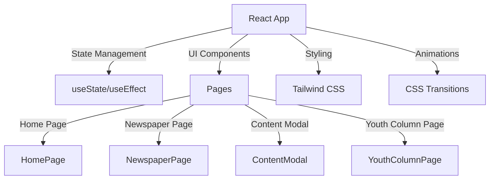

## 1. Architecture Design


## 2. Technology Description
- 前端: React@18 + Next.js + TypeScript + Tailwind CSS
- 构建工具: Next.js
- 样式: Tailwind CSS
- 动画: CSS transitions 和 keyframes

## 3. Route Definitions
| Route | Purpose |
|-------|---------|
| / | 首页和主界面 |

## 4. Component Structure
### 4.1 Main Components
- `HomePage`: 首页组件，包含标题、主题图、读报按钮
- `NewspaperPage`: 报纸主界面，包含背景图切换和热区
- `ContentModal`: 通用内容模态框
- `YouthColumnPage`: 青年专栏AVG界面

### 4.2 State Management
使用 React 内置的 `useState` 和 `useEffect` 管理页面状态

### 4.3 Hotspot Configuration
每个背景图的热区独立配置，格式如下：
```typescript
interface Hotspot {
  name: string;
  x: number;  // left percentage
  y: number;  // top percentage
  width: number;  // width percentage
  height: number;  // height percentage
}
```

## 5. Animation Implementation
- 页面切换: CSS opacity transitions
- 元素渐显: CSS keyframes animation with delay
- 热区hover: transform scale + box-shadow
- 云雾特效: 全屏白色渐变 + blur + fade out

