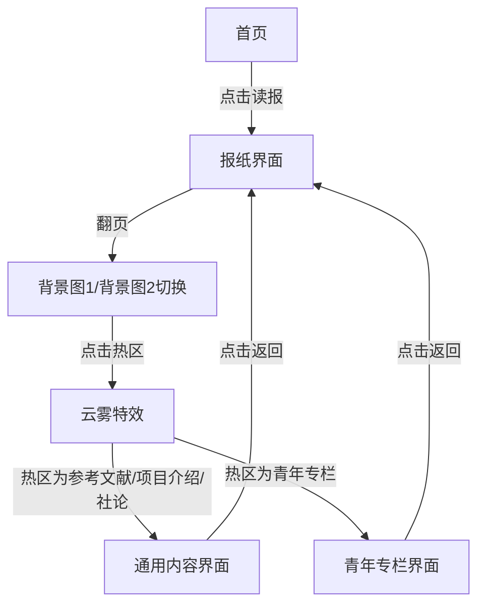

## 1. Product Overview
思传达学互动报纸网页 - 一个具有复古报纸风格的互动网页，包含多个热区和特殊界面，提供沉浸式的阅读体验。
- 主要目的是创建一个独特的互动阅读界面，结合了现代网页动画和复古美学设计
- 目标用户是对创新网页设计和互动体验感兴趣的用户

## 2. Core Features

### 2.1 Feature Module
1. **首页**: 渐隐主题图、标题区域、动画效果、读报按钮
2. **主报纸界面**: 双背景图切换、翻页按钮、热区交互
3. **通用内容界面**: 模态框展示、滚动内容、返回功能
4. **青年专栏界面**: AVG风格对话框、对话切换、选项按钮

### 2.3 Page Details
| Page Name | Module Name | Feature description |
|-----------|-------------|---------------------|
| 首页 | 渐隐主题图 | 宽100%高200px灰色图片，边缘渐隐效果 |
| 首页 | 标题区域 | 主标题"思传达学"，副标题和拼音，带渐显动画 |
| 首页 | 读报按钮 | 点击后隐藏首页，显示报纸界面 |
| 主报纸界面 | 背景图切换 | 两个背景图切换，带淡入淡出动画 |
| 主报纸界面 | 翻页按钮 | 右下角按钮，切换背景图 |
| 主报纸界面 | 热区交互 | 每个背景图两个热区，hover效果，点击后云雾特效 |
| 通用内容界面 | 模态框 | 深色半透明背景，内容区域带滚动条 |
| 通用内容界面 | 返回按钮 | 右上角X按钮，关闭模态框 |
| 青年专栏界面 | AVG对话框 | 做旧报纸风格，底部显示 |
| 青年专栏界面 | 对话切换 | 点击对话框切换3段文字 |
| 青年专栏界面 | 选项按钮 | 三个按钮，居中显示 |

## 3. Core Process
用户进入首页 → 点击"读报"按钮 → 进入报纸界面 → 可以翻页切换背景图 → 点击热区 → 云雾特效 → 进入对应内容界面 → 返回报纸界面

## 4. User Interface Design
### 4.1 Design Style
- 主色调：深色调（暗背景）
- 次要色：灰色、白色、泛黄纸张色
- 按钮风格：简约边框按钮
- 字体：宋体/衬线字体
- 布局风格：全屏布局，居中对齐
- 动画：页面过渡淡入淡出，元素渐显

### 4.2 Page Design Overview
| Page Name | Module Name | UI Elements |
|-----------|-------------|-------------|
| 首页 | 渐隐主题图 | 灰色占位图，边缘透明渐变，宽100%高200px |
| 首页 | 标题区域 | 主标题大字号宋体，副标题较小，居中，渐显动画 |
| 首页 | 读报按钮 | 简约按钮，居下，hover效果 |
| 主报纸界面 | 背景图 | 占满主要区域，居中保持比例 |
| 主报纸界面 | 翻页按钮 | 右下角，简约风格 |
| 主报纸界面 | 热区 | 透明/半透明可点击区域，hover放大带阴影 |
| 通用内容界面 | 模态框 | 深色半透明背景，内容区域带滚动条 |
| 通用内容界面 | 返回按钮 | 右上角X |
| 青年专栏界面 | 对话框 | 底部，泛黄纸风格，不规则边框 |
| 青年专栏界面 | 选项按钮 | 居中三个，报纸风格按钮 |

### 4.3 Responsiveness
- 桌面端优先，适配主流屏幕尺寸
- 热区使用百分比定位，便于不同分辨率适配

